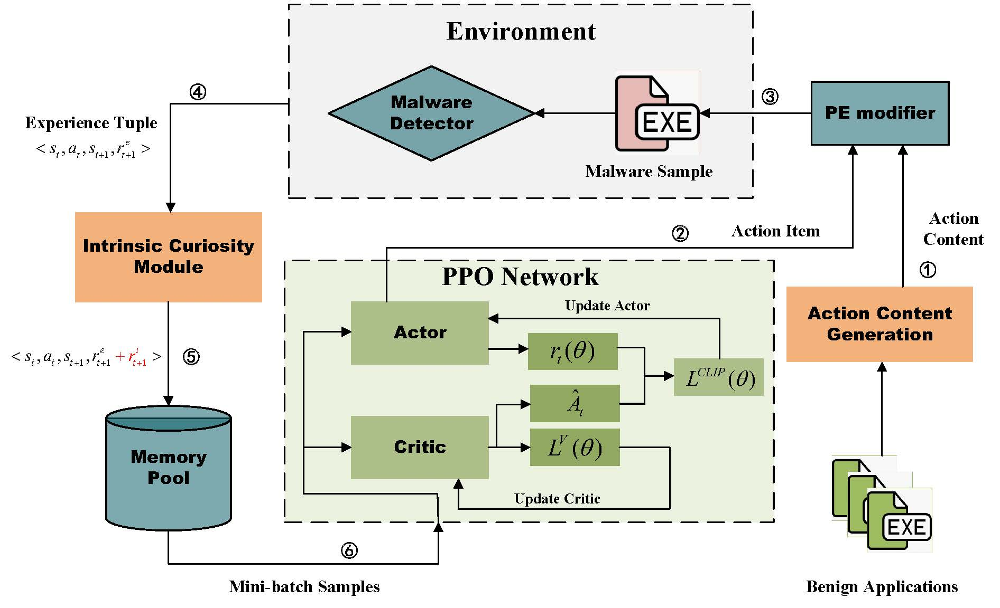
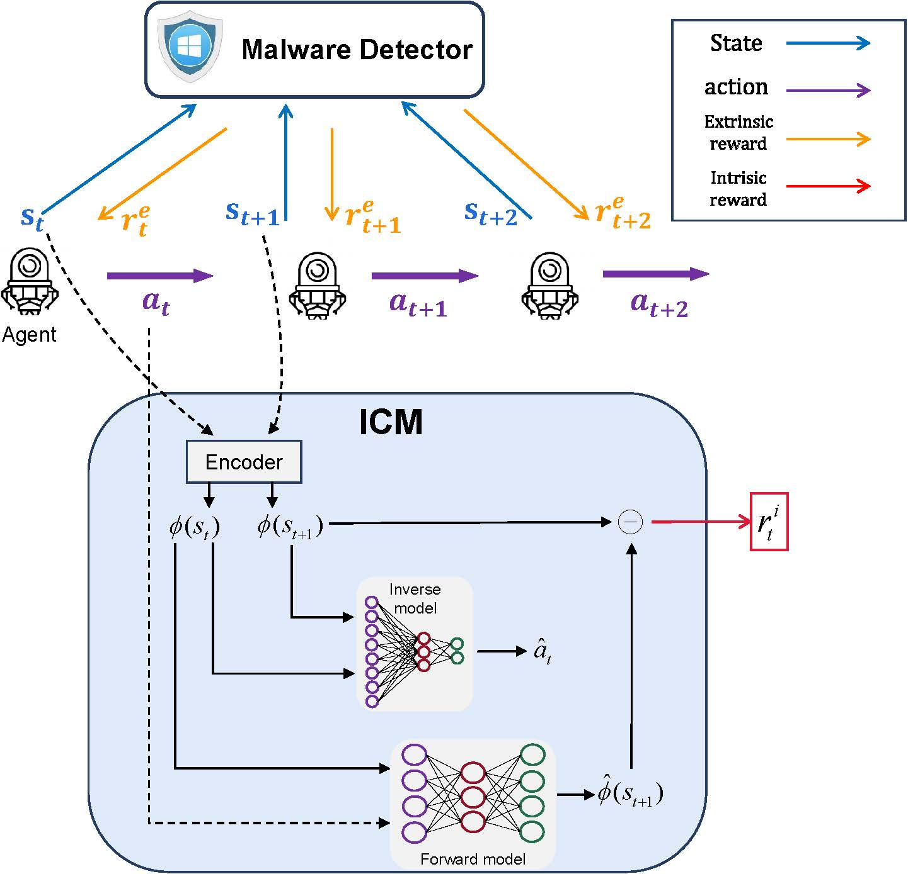
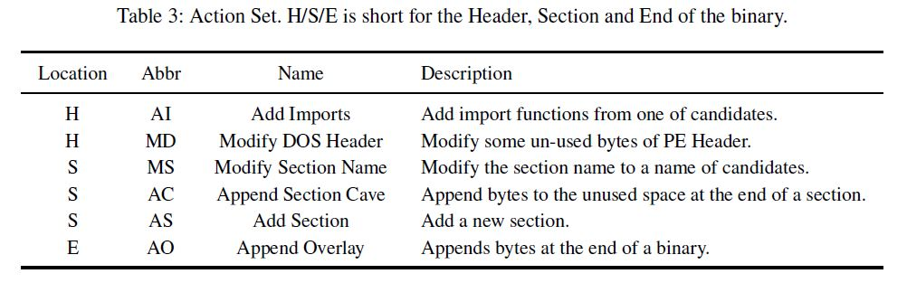
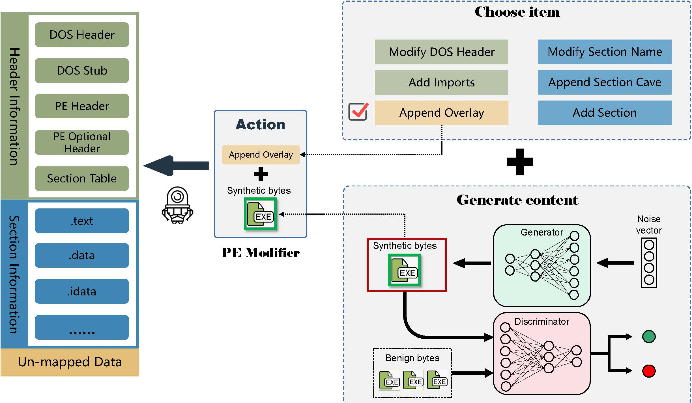

# EnhancingRLAMG
Enhancing RL-based Adversarial Malware Generation to Evade Static Detection

In the black-box scenario where internal information of the target model cannot be accessed, existing RL-based methods enable evasion of Windows PE malware detectors. However, obtaining evasion rewards as positive feedback in the black-box setting proves challenging for RL frameworks, resulting in low training efficiency. To address this issue, we introduce the intrinsic curiosity reward into the framework to motivate the agent to explore unknown state spaces and learn effective evasion strategies. Additionally, we employ the generative adversarial network (GAN) to obtain varying synthetic data, which replaces random or benign bytes as adversarial payloads for the agent's action content, improving attack capabilities and reducing the risk of hard-coded adversarial perturbations being anchored.

 
 
## Environment
We expose OpenAI's `gym` environments and extends the [malware_rl](https://github.com/bfilar/malware_rl) repo to allow researchers to develop Reinforcement Learning agents to bypass three malware detectors, including [Ember](https://github.com/endgameinc/ember) (Endgame Malware BEnchmark for Research) ([paper](https://arxiv.org/abs/1804.04637)), [MalConv](https://arxiv.org/abs/1710.09435), and [FireEye](https://arxiv.org/abs/1903.04717). 

During the policy learning phase, the agent observes the current state of the malware, and selects an action from the action space based on the existing policy. The same feature representation as the malware detector is used as the state space of the environment. Combined with the action content generated by the ACG, the PE modifier takes action to modify the malware sample to the next state. The environment reward is calculated based on the prediction label provided by the malware detector. The ICM computes the intrinsic curiosity reward and updates the rewards in the experience trajectory. The trajectory is then stored in the memory pool and sampled to update the agent's policy.
 
### State Space
The same feature representation as the malware detector is used as the state space of the environment. For MalConv and FireEye, the state is a 2**20 dimensional feature vector, while the dimension is reduced to 2381 when attacking EMBER.

### Intrinsic curiosity module

 
 
### Action content generation
Actions include 6 functionality-preserving modifications. Five actions are inherited from [Gym-malware](https://github.com/endgameinc/gym-malware)([paper](https://arxiv.org/abs/1801.08917)), and we add the action `Modify DOS Header (MD)` to modify some unused bytes in the DOS Header.

We build the action content generation module to generate adversarial payloads using a generative adversarial network (GAN). The generator in the module can generate synthetic bytes to mimic real benign software. These synthetic bytes have similar features to benign applications in the dataset, and different random seeds will generate fragments with different content.

## Setup
The framework is built on Python3.7 and we leverages the [LIEF](https://github.com/lief-project/LIEF) and [PEfile](https://github.com/erocarrera/pefile) to perform functionality-preserving modifications.

To get this repo running you need prepare the following data:

- Target detector - [MalConv](https://github.com/PowerLZY/MalConv-Pytorch), [FireEye](https://github.com/UCdasec/MultiEvasion/blob/main/src/model.py), and [Ember](https://github.com/Azure/2020-machine-learning-security-evasion-competition/blob/master/defender/defender/models/ember_model.txt.gz). Model files need to be placed into the `malware_rl/envs/utils/` directory.

- synthetic bytes - We train DP-GAN using 3000 byte fragments extracted from benign software to generate synthetic bytes based on [TextGAN](https://github.com/williamSYSU/TextGAN-PyTorch) platform. These synthetic byte fragments are used as adversarial payloads for the agent's actions during attacks. The training materials is provided in `benign_train` and `benign_test`, and the generated synthetic bytes need to be placed into the `malware_rl/envs/controls/trusted_dpgan` directory.
  
- Benign content - a small set of "trusted" binaries (e.g. grabbed from base Windows installation) you can download some via [PortableApps](https://portableapps.com). And then store these binaries in `malware_rl/envs/controls/trusted_benign`.

- Malware samples - Store malware samples in `malware_rl/envs/utils/samples`. Though we cannot release the malware downloaded by [Virustotal](https://www.virustotal.com/)，we offer the list of hashes of samples in `sample_hash.txt`
